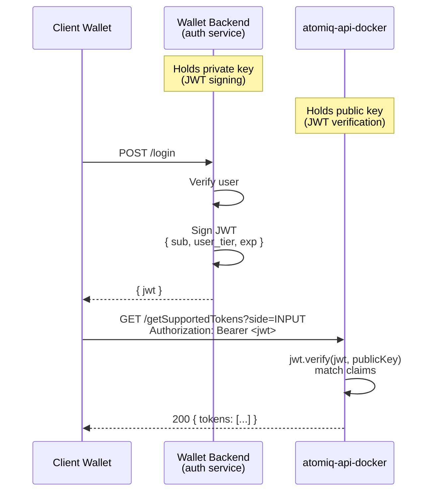
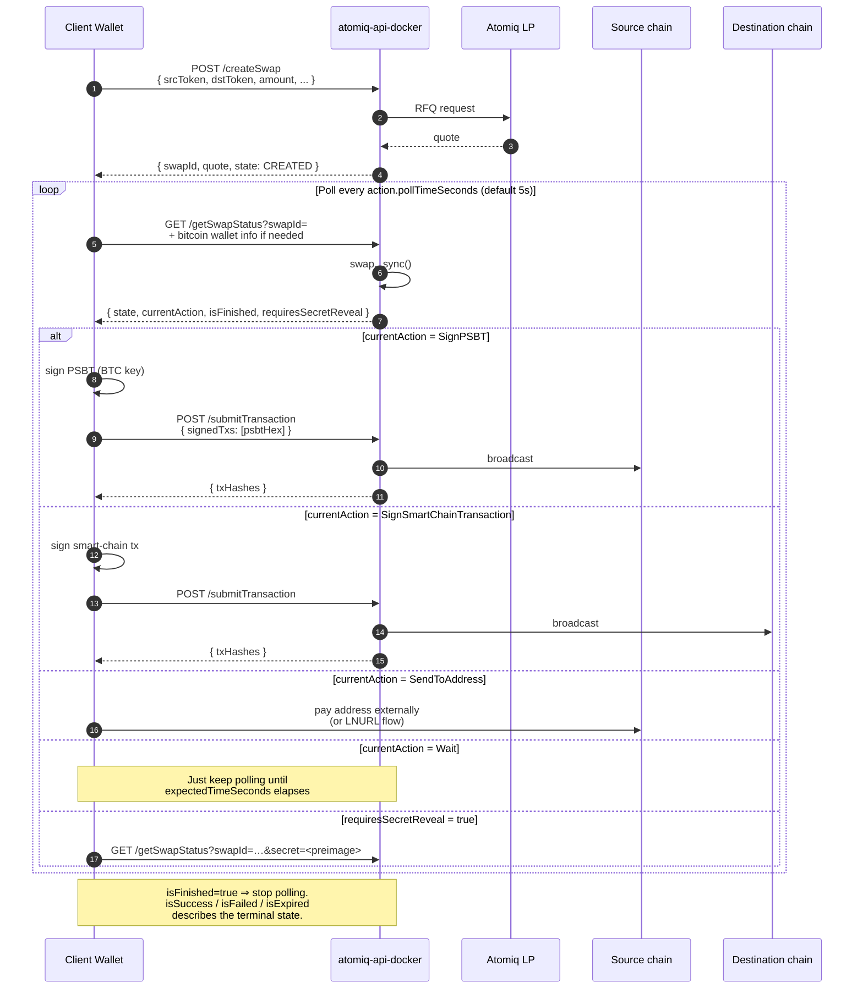

# atomiq-api-docker

A dockerized HTTP API for the [Atomiq](https://atomiq.exchange) cross-chain DEX.

It lets you offer trustless swaps between **Bitcoin / Lightning** and smart chains (**Starknet, Solana, Botanix, Citrea, Alpen, Goat**) without bundling the full Atomiq SDK into every mobile, extension, or web client.

This document is written for integrators at wallet companies (think Xverse, Leather, or Phantom-style wallets), but it's just as useful if you simply want to run `atomiq-api-docker` as part of your own infrastructure and expose swaps to your users.

> The repo also contains helper scripts in `scripts/` (`create-swap.ts`, `process-swap.ts`, `generate-jwt.ts`, `test-all-directions.ts`). Those are a reference client / test harness, not part of the API surface. This README focuses on the **API** you deploy.

---

## Contents

- [What this service is](#what-this-service-is)
- [System architecture](#system-architecture)
- [Where Atomiq liquidity comes from](#where-atomiq-liquidity-comes-from)
- [Quick start](#quick-start)
- [Configuration (`config.yaml`)](#configuration-configyaml)
- [Authentication model](#authentication-model)
- [Rate limiting](#rate-limiting)
- [HTTPS and certificate reload](#https-and-certificate-reload)
- [API reference](#api-reference)
- [Swap lifecycle](#swap-lifecycle)
- [Action types returned by `getSwapStatus`](#action-types-returned-by-getswapstatus)
- [Lightning and LNURL](#lightning-and-lnurl)
- [Persistence](#persistence)
- [Background maintenance timers](#background-maintenance-timers)
- [Error handling](#error-handling)
- [Security notes](#security-notes)

---

## What this service is

`atomiq-api-docker` is a thin, stateful HTTP layer over the Atomiq SDK:

- Embeds one **`SwapperApi`** instance wired to all supported smart chains.
- Exposes **10 HTTP endpoints** (quoting, creating, listing, polling, submitting swaps).
- Holds the **local swap database** (SQLite files mounted into the container) and keeps them in sync in the background.
- Provides **API-key** and **JWT** auth with per-path rate-limit overrides, so the same instance can serve both a trusted backend and untrusted public clients.
- Supports **HTTPS with hot certificate reload**, so you can run it directly with `certbot`-based TLS/SSL certificate provisioning

### What it deliberately is not

- **Not a custodian.** Atomiq swaps are trustless HTLC / PSBT / SPV-vault flows — the API never holds user keys. All signing happens in the **client wallet**; the API only generates unsigned transactions and submits signed ones.
- **Not a liquidity provider.** Quotes come from the Atomiq LP network (see [Where Atomiq liquidity comes from](#where-atomiq-liquidity-comes-from)).
- **Not a UI.** It is a backend service. You build the wallet UX around it.

---

## System architecture

The diagram below shows one representative deployment in which a wallet backend fronts the API for its own end users. `atomiq-api-docker` does not require this exact topology — it can just as well be consumed directly by a frontend, by a standalone script, or by any other service that can speak HTTP and sign transactions client-side. Treat the three-party split as one illustrative example rather than a prescribed layout.

There are three parties in this typical integration:


**Why three parties?**

| Party | Role | Talks to |
|---|---|---|
| **Client wallet** | Holds keys. Signs PSBTs and smart-chain transactions. | Your wallet backend, `atomiq-api-docker` |
| **Wallet backend** | Issues JWTs to authenticated end users. Optionally calls `atomiq-api-docker` with an API key for privileged admin flows. Hosts `atomiq-api-docker`. | Clients, `atomiq-api-docker` |
| **`atomiq-api-docker`** | Single stateful process that talks to Atomiq LPs and all chain RPCs, persists swap state, returns actions the client must sign. | LPs, chain RPCs, clients, backend |

Typical deployment: the wallet backend runs the container on an internal network, terminates TLS on it directly (or behind a reverse proxy), and end-user clients hit it with a short-lived JWT issued by the backend's auth service.

---

## Where Atomiq liquidity comes from

`atomiq-api-docker` is a client of the Atomiq LP network. It does **not** run an LP itself. When you call `createSwap`, the SDK:

1. Looks up registered LP nodes for the requested token pair.
2. Requests a quote (RFQ) from one or more of them.
3. Returns the best quote with fees and expiry.

If liquidity drops (LP goes offline, channel closes, etc.) the instance periodically reloads the LP list in the background — see [Background maintenance timers](#background-maintenance-timers).

---

## Quick start

### Prerequisites

- Docker 24+ with the Docker Compose plugin (`docker compose` v2).
- RPC endpoints for the smart chains you want to enable. Mainnet Bitcoin is configured by network name only (no RPC).

### 1. Build the image

```bash
sh build.sh
# equivalent to: docker build -t atomiqlabs/api .
```

The final image is Alpine-based, ~280 MB.

### 2. Create `config/config.yaml`

Start from `config/config.yaml.example`:

```bash
cp config/config.yaml.example config/config.yaml
```

Minimum viable config (testnet, public access, no TLS):

```yaml
port: 3000
logLevel: info

starknetRpc: "https://rpc.starknet.lava.build/"
solanaRpc:   "https://api.devnet.solana.com"
bitcoinNetwork: TESTNET

cors:
  origin: "*"

rateLimit:
  windowMs: 60000
  maxRequests: 200

auth:
  - type: none
    name: "Public"
```

### 3. Run

Use the bundled `docker-compose.yml`:

```bash
docker compose up -d
# if this doesn't work, try: docker-compose up -d
```

This starts the service on port `3000`, mounts `./config` read-only, and persists the SQLite swap databases in the host `./storage` directory so they survive container restarts — see [Persistence](#persistence). The bundled compose file also sets `CONFIG_PATH=/src/config/config.yaml` and `STORAGE_DIR=/src/storage`.

You can check the API server's logs with:

```bash
docker compose logs -f
# if this doesn't work, try: docker-compose logs -f
```

On startup you should see:

```
Initializing SwapperApi...
SwapperApi initialized.
Chains: STARKNET, SOLANA, ...
atomiq-api listening on port 3000
  POST /createSwap
  GET  /listSwaps
  ...
```

### 4. Smoke test

```bash
curl "http://localhost:3000/getSupportedTokens?side=INPUT"
```

---

## Configuration (`config.yaml`)

The service reads its entire runtime config from a single YAML file. It is configured using the `CONFIG_PATH` environment variable, by default the file is located in `config/config.yaml`:

Top-level keys:

| Key                                                                               | Type                                          | Default                 | Description                                                                                        |
|-----------------------------------------------------------------------------------|-----------------------------------------------|-------------------------|----------------------------------------------------------------------------------------------------|
| `port`                                                                            | number                                        | **required**            | TCP port the server binds to.                                                                      |
| `logLevel`                                                                        | `error`\|`warn`\|`info`\|`debug`              | `info`                  | `info` = morgan HTTP logs; `debug` = verbose per-request log line incl. IP, XFF, UA.               |
| `bitcoinNetwork`                                                                  | `MAINNET`\|`TESTNET`\|`TESTNET3`\|`TESTNET4`  | **required**            | Which Bitcoin network the SDK connects to. `TESTNET` is an alias for `TESTNET3`.                   |
| `starknetRpc` / `solanaRpc` / `botanixRpc` / `citreaRpc` / `alpenRpc` / `goatRpc` | string or null                                | null (disabled)         | RPC URL per smart chain. Omit / set to null to disable that chain.                                 |
| `swapsSyncIntervalSeconds`                                                        | number                                        | 300                     | Interval between background `SwapperApi.sync()` calls (purges expired swaps, refreshes state).     |
| `reloadLpIntervalSeconds`                                                         | number                                        | 300                     | Interval between background LP reloads (re-discovers dropped LPs).                                 |
| `cors`                                                                            | object or null                                | null (disabled)         | Passed through to the [`cors`](https://github.com/expressjs/cors) middleware.                      |
| `rateLimit`                                                                       | `{ windowMs, maxRequests }`                   | **required**            | Global fallback rate limit (applied when an auth path does not override).                          |
| `auth`                                                                            | array                                         | **required**, non-empty | Ordered list of auth paths — see below.                                                            |
| `https`                                                                           | `{ keyPath, certPath }` or null               | null (HTTP)             | TLS config. Paths are resolved relative to the config file.                                        |
| `trustProxy`                                                                      | boolean                                      | `false`                       | When running the API behind a reverse proxy, set this to `true` to properly parse the user's IP addresses |

---

## Authentication model

`auth` is an **ordered array** — the first entry that matches a request wins. Each entry can optionally set its own `rateLimit` (or `null` to disable rate limiting entirely on that path).

Three entry types:

```yaml
auth:
  # 1. Backend-to-backend: trusted wallet backend
  - type: apiKey
    name: "Wallet Backend"
    apiKey: "replace-with-long-random-secret"
    header: x-api-key          # optional, default x-api-key
    rateLimit: null             # null = no rate limit on this path

  # 2. End-user auth: JWT signed by your auth service
  - type: jwt
    name: "Premium Users"
    publicKey: "-----BEGIN PUBLIC KEY-----\n...\n-----END PUBLIC KEY-----"
    algorithms: [RS256]         # or [ES256], etc.
    claims:                     # optional — all claims must match
      user_tier: "swapper"
    rateLimit:
      windowMs: 60000
      maxRequests: 200

  # 3. Open fallback (uses global rateLimit)
  - type: none
    name: "Public"
```

### API-key auth

Any client that can present the configured shared secret in a header (default `x-api-key`) is authorized on this path.

```http
GET /listSwaps?signer=0x... HTTP/1.1
x-api-key: replace-with-long-random-secret
```

Treat the API key as a shared secret. Whether you ship it to a trusted backend, embed it in a first-party frontend, or hand it to an operator depends on your threat model — just never expose it to clients you do not control.

### JWT auth

Requests are authorized by a signed JWT in the `Authorization: Bearer <jwt>` header. The service:

1. Verifies the JWT signature against the public key configured in `config.yaml` using the algorithms listed in `algorithms`.
2. Enforces the standard `exp` claim.
3. Checks any additional required claims listed under `claims` on the auth entry.

How the JWT is minted and delivered to the caller is out of scope for this service — issue it from any auth system that can sign with a key pair whose public half you paste into `config.yaml`.



`claims` supports two forms:

- Exact match: `{ user_tier: "swapper" }` — the JWT payload must contain a matching scalar value.
- Array-includes: `{ permissions: { includes: "swap_permission" } }` — the JWT payload must contain an array that includes the given value.

#### Generating a test key pair + JWT

A helper script is bundled for local testing:

```bash
npx ts-node --project tsconfig.scripts.json \
  scripts/generate-jwt.ts \
  '{"payload":{"sub":"demo","user_tier":"swapper"},"options":{"expiresIn":"1h"}}'
```

It prints:

- A freshly generated ES256 (P-256) private key (PEM).
- The matching public key in both multi-line and single-line PEM form — paste the single-line form into `auth[].publicKey` in `config.yaml`.
- A signed JWT you can use immediately with `Authorization: Bearer ...`.

Pass an existing private key as the second argument to sign with your own key instead.

### Public / no-auth

`type: none` matches any request. Put it last if you want to offer anonymous access; omit it if all traffic must be authenticated.

---

## Rate limiting

Uses in-memory bucketing per client IP, with a fixed window.

- Each auth entry can set its own `rateLimit: { windowMs, maxRequests }` or explicitly `null` (no limit — typical for `apiKey` backend traffic).
- If an auth entry has **no** `rateLimit` key, the **global** `rateLimit` from the top level applies.
- Exceeding the limit returns `429 { error: "Rate limit exceeded", retryAfter }`.

---

## HTTPS and certificate reload

Set `https` in the config to run TLS directly:

```yaml
https:
  keyPath: "./tls/server.key"
  certPath: "./tls/server.cert"
```

Both paths are resolved relative to the `config.yaml` file. With the bundled compose layout that means you can keep the certificate, key, or symlinks to them under `config/tls/` and mount the whole config directory into the container read-only.

The server watches both files with a 1 s poll interval. On any change it schedules a **60 s-delayed reload** (debounced) via `server.setSecureContext(...)` — Node keeps serving existing connections during the swap. This is designed to work cleanly with Let's Encrypt / certbot renewal hooks: the renewal hook writes both files, the server picks them up within a minute without a restart.

---

## Running behind reverse proxy

Set the `trustProxy` config option if you run the API behind a reverse proxy and want to correctly resolve client IP addresses (important for rate limitting)

```yaml
trustProxy: true
```

You can also let the reverse proxy handle the HTTPS connections and then don't have to setup the `https` for the API

---

## API reference

All endpoints live at the root (`/`). Names and shapes come directly from the SDK's `SwapperApi.endpoints`. `GET` endpoints read their parameters from the query string; `POST` endpoints read a JSON body.

| Method | Path | Purpose |
|---|---|---|
| `GET`  | `/getSupportedTokens` | Tokens usable as input or output. |
| `GET`  | `/getSwapCounterTokens` | Tokens that can pair with a given token. |
| `GET`  | `/getSwapLimits` | Min / max amounts between a token pair. |
| `GET`  | `/parseAddress` | Parse an address / invoice / LNURL / URI. |
| `GET`  | `/getSpendableBalance` | Wallet balance net of fees, for a given token. |
| `POST` | `/createSwap` | Request a quote and open a swap. |
| `GET`  | `/getSwapStatus` | Poll for the next action the wallet must take. |
| `POST` | `/submitTransaction` | Submit signed transactions back. |
| `GET`  | `/listSwaps` | All swaps for a signer (optionally scoped by chain). |
| `GET`  | `/listActionableSwaps` | Swaps that currently need the user's attention. |

### Token identifiers

Tokens are identified by the string containing the network and the ticker, generally `<network>-<ticker>`. Typical values:

- `BITCOIN-BTC` (on-chain Bitcoin)
- `LIGHTNING-BTC` (Lightning BTC)
- `STARKNET-STRK`, `STARKNET-ETH`, `STARKNET-<erc20-address>`
- `SOLANA-SOL`, `SOLANA-<spl-mint>`
- `CITREA-CBTC`, `BOTANIX-BTC`, etc.

Use `GET /getSupportedTokens` to enumerate what the current LP set supports.

### `POST /createSwap`

Creates a swap and returns a quote.

Request body:

| Field | Type | Required | Notes                                                                                                           |
|---|---|---|-----------------------------------------------------------------------------------------------------------------|
| `srcToken` | string | ✓ | e.g. `BITCOIN-BTC`, `STARKNET-STRK`.                                                                            |
| `dstToken` | string | ✓ |                                                                                                                 |
| `amount` | bigint (as string) | ✓ | Base units.                                                                                                     |
| `amountType` | `EXACT_IN` \| `EXACT_OUT` | ✓ |                                                                                                                 |
| `srcAddress` | string | (✓ for smart → BTC/LN) | Also supports LNURL-withdraw link when `srcToken = LIGHTNING-BTC`.                                                    |
| `dstAddress` | string | ✓ | Destination on the output chain. Also: LNURL-pay link, Lightning invoice, etc. when `dstToken = LIGHTNING-BTC`. |
| `gasAmount` | bigint | optional | Gas token to drop on the destination chain.                                                                     |
| `paymentHash` | hex string | optional | Client-supplied payment hash for Lightning swaps (so the client can retain the preimage).                       |
| `description` / `descriptionHash` | string / hex | optional | Lightning invoice metadata.                                                                                     |
| `expirySeconds` | number | optional | Custom quote expiry.                                                                                            |

Response body is a **swap record**:

```jsonc
{
  "swapId": "…",
  "swapType": "FROM_BTC_LN_AUTO",
  "state": { "number": 1, "name": "CREATED", "description": "…" },
  "quote": {
    "inputAmount":  { "amount": "0.00003", "rawAmount": "3000", "decimals": 8, "symbol": "BTC", "chain": "BITCOIN" },
    "outputAmount": { "amount": "4.21",    "rawAmount": "4210000000000000000", "decimals": 18, "symbol": "STRK", "chain": "STARKNET" },
    "fees": {
      "swap":          { "amount": "0.000001", "rawAmount": "100", "decimals": 8, "symbol": "BTC", "chain": "BITCOIN" },
      "networkOutput": { "amount": "…", "rawAmount": "…", "decimals": 0, "symbol": "…", "chain": "…" }
    },
    "expiry": 1713360000000
  },
  "createdAt": 1713359700000,
  "steps": [ /* SwapExecutionStep[] — hints for UX, see below */ ]
}
```

#### Swap execution steps

`steps` is a UX hint that describes the swap as a linear sequence of stages the user progresses through. Each step declares which side of the swap it belongs to (`source` / `destination`), the relevant `chain`, a human-readable `title` / `description`, and a `status` that advances as the swap moves forward. Steps are best used to render a progress strip in the wallet UI; the actionable state lives in `currentAction` returned by `getSwapStatus`.

| `type` | Meaning | Statuses |
|---|---|---|
| `Setup` | Destination-side setup required before the swap can continue (e.g. creating the destination HTLC / escrow). | `awaiting`, `completed`, `soft_expired`, `expired` |
| `Payment` | The user's payment that initiates or funds the swap on the source side. | `inactive`, `awaiting`, `received`, `confirmed`, `soft_expired`, `expired` |
| `Settlement` | Payout / settlement on the destination side. | `inactive`, `waiting_lp`, `awaiting_automatic`, `awaiting_manual`, `soft_settled`, `soft_expired`, `settled`, `expired` |
| `Refund` | Source-side refund path after a failed swap. | `inactive`, `awaiting`, `refunded` |

Bitcoin `Payment` steps additionally include a `confirmations: { current, target, etaSeconds }` progress object once the funding transaction has been seen on-chain. All step objects carry `initTxId`, `settleTxId`, `setupTxId`, or `refundTxId` fields as the relevant transactions are broadcast — these are convenient to link into a block explorer.

### `GET /getSwapStatus`

Polled continuously by the client. Returns the **current action** the wallet must perform.

Query parameters:

| Field | Type | Required | Notes |
|---|---|---|---|
| `swapId` | string | ✓ | |
| `secret` | hex | optional | Lightning preimage to reveal — see [Lightning and LNURL](#lightning-and-lnurl). |
| `bitcoinAddress` | string | optional | Needed when the swap will produce a PSBT for the client's BTC wallet. |
| `bitcoinPublicKey` | hex | optional | Must be passed together with `bitcoinAddress`. |
| `bitcoinFeeRate` | number | optional | sat/vB override for PSBT building. |
| `signer` | string | optional | Alternative smart-chain signer for refunds / manual settlement. |

Response extends the swap record with:

```jsonc
{
  "swapId": "…",
  "swapType": "FROM_BTC_LN_AUTO",
  "state": { "number": 1, "name": "CREATED", "description": "…" },
  "quote": {
    "inputAmount":  { "amount": "0.00003", "rawAmount": "3000", "decimals": 8, "symbol": "BTC", "chain": "BITCOIN" },
    "outputAmount": { "amount": "4.21",    "rawAmount": "4210000000000000000", "decimals": 18, "symbol": "STRK", "chain": "STARKNET" },
    "fees": {
      "swap":          { "amount": "0.000001", "rawAmount": "100", "decimals": 8, "symbol": "BTC", "chain": "BITCOIN" },
      "networkOutput": { "amount": "…", "rawAmount": "…", "decimals": 0, "symbol": "…", "chain": "…" }
    },
    "expiry": 1713360000000
  },
  "createdAt": 1713359700000,
  "steps": [ /* SwapExecutionStep[] — hints for UX */ ]
  "isFinished": false,
  "isSuccess":  false,
  "isFailed":   false,
  "isExpired":  false,
  "currentAction": { "type": "SendToAddress" },
  "requiresSecretReveal": false
}
```

See [Action types](#action-types-returned-by-getswapstatus) for the shapes of `currentAction`.

### `POST /submitTransaction`

Submits client-signed transactions.

```jsonc
{ "swapId": "…", "signedTxs": ["<hex>", "<hex>"] }
```

- **SignPSBT** → each `signedTxs[i]` is the **hex-encoded or base64-encoded signed PSBT**.
- **SignSmartChainTransaction** → the format depends on the chain:
  - **Solana**: hex-encoded serialized Solana transaction (use `partialSign`, the LP may already have co-signed).
  - **Starknet**: JSON-stringified envelope (`{ type, signed, details, ... }`) as returned by the action, with a populated `signed` field.
  - **EVM** (Botanix / Citrea / Alpen / Goat): hex-encoded Ethereum raw-transaction string.

Response:

```jsonc
{ "txHashes": ["0x…"] }
```

See `scripts/process-swap.ts` for a full, per-chain signing reference implementation.

### `GET /listSwaps` / `GET /listPendingSwaps`

```
?signer=<address>&chainId=STARKNET
```

- `signer` is a smart-chain address — required.
- `chainId` is optional; when omitted, swaps from all chains are returned.
- `listPendingSwaps` filters down to swaps which are pending (the set you probably want for a "needs your attention" badge in the wallet UI).

### `GET /getSupportedTokens` / `GET /getSwapCounterTokens` / `GET /getSwapLimits`

Quote-time helpers:

- `getSupportedTokens?side=INPUT|OUTPUT` — tokens you can put on that side of a swap.
- `getSwapCounterTokens?token=STARKNET-STRK&side=INPUT` — tokens that can pair with STRK when STRK is the input.
- `getSwapLimits?srcToken=…&dstToken=…` — `{ input: { min, max? }, output: { min, max? } }`.

### `GET /parseAddress`

```
?address=<string>
```

Normalizes any address-like input the wallet paste field might receive: on-chain addresses, Lightning invoices, LNURL-pay / LNURL-withdraw links, Bitcoin URIs. Returns the parsed `type`, `address`, and — for LNURLs — min/max/amount and the deserialized LNURL payload.

### `GET /getSpendableBalance`

```
?wallet=<address>&token=<tokenId>[&targetChain=STARKNET][&gasDrop=true][&feeRate=…][&minBitcoinFeeRate=…][&feeMultiplier=…]
```

Net spendable balance of a wallet for a given token, accounting for chain fees. Bitcoin and smart-chain tokens accept different optional parameters — see the [`getSpendableBalance`](../../atomiq-sdk/openapi.json) entry in the OpenAPI spec for the authoritative list of query parameters and the chain-specific `feeRate` format.

Lightning balances are **not** supported by this endpoint (the SDK throws).

---

## Swap lifecycle

The flow is the same for every direction: create → poll → sign → submit → repeat until finished.



### Minimal client-side loop (pseudocode)

```ts
const { swapId } = await post("/createSwap", { srcToken, dstToken, amount, amountType, dstAddress });

for (;;) {
  const s = await get("/getSwapStatus", { swapId, bitcoinAddress, bitcoinPublicKey });
  if (s.isFinished) break;

  if (s.requiresSecretReveal) {
    await get("/getSwapStatus", { swapId, secret: preimageHex });
    continue;
  }

  const action = s.currentAction;
  switch (action?.type) {
    case "SignPSBT":                    /* sign with BTC key */; break;
    case "SignSmartChainTransaction":   /* sign per action.chain */; break;
    case "SendToAddress":               /* show address to user */; break;
    case "Wait":                        /* no-op */; break;
  }
  if (signedTxs) await post("/submitTransaction", { swapId, signedTxs });

  await sleep((action?.pollTimeSeconds ?? 5) * 1000);
}
```

`scripts/process-swap.ts` is the canonical reference implementation — it handles Solana `partialSign`, Starknet invoke vs. deploy-account, EVM raw transactions, PSBT input selection, and LNURL settlement.

---

## Action types returned by `getSwapStatus`

`currentAction` is one of (all common fields: `type`, `name`, `pollTimeSeconds`):

| `type` | Wallet must… | Key fields |
|---|---|---|
| `SignPSBT` | Sign Bitcoin PSBTs. | `txs: [{ psbtHex, type, signInputs: number[] }]` |
| `SignSmartChainTransaction` | Sign chain-native transactions. | `chain: "SOLANA"\|"STARKNET"\|"BOTANIX"\|...`, `txs: string[]` (chain-specific envelope) |
| `SendToAddress` | Pay an address out of band (usually BTC / Lightning). | `txs: [{ address, amount: ApiAmount, name }]` |
| `Wait` | Do nothing, just poll. | `expectedTimeSeconds` |

Pass the client's BTC `bitcoinAddress` + `bitcoinPublicKey` on every `/getSwapStatus` call — the API needs them to build funded PSBTs for the Bitcoin → smart chain direction.

---

## Lightning and LNURL

Two ways to handle Lightning LNURL links:

### a) Recommended: client-side LNURL

Prefer resolving LNURLs on the client (wallet UI) and passing the resulting lightning invoice / payee info to `/createSwap`. This minimizes the trust the client places on the middleware: the API never sees a link that, if replaced, could redirect funds.

### b) Supported: pass LNURLs directly

You can pass an LNURL-withdraw link as `srcAddress` (for `LIGHTNING-BTC → *`) or an LNURL-pay link as `dstAddress` (for `* → LIGHTNING-BTC`) — the SDK resolves them internally, which implies you trust the API server to resolve them properly.

---

### Preimage reveal

For `LIGHTNING-BTC → smart-chain` flows, the client usually generates a random 32-byte preimage and passes `paymentHash = sha256(preimage)` into `/createSwap`. When `/getSwapStatus` returns `requiresSecretReveal: true`, the client reveals the preimage by calling `/getSwapStatus?swapId=…&secret=<hex>`. The API then broadcasts this secret over Nostr to allow for automatic settlement or uses it to generate proper settlement transactions which are then returned to the user for signing.

---

## Persistence

The container writes SQLite files into the directory pointed to by `STORAGE_DIR`. By default this uses the `./storage` directory.

- `CHAIN_atomiqsdk-1-<CHAINID>.sqlite3` — one per active smart chain; swap state for that chain.
- `STORE_<name>.sqlite3` — additional SDK state (e.g. `solAccounts`).

The bundled `docker-compose.yml` mounts `./config` read-only into `/src/config`, mounts `./storage` into `/src/storage`, and sets `CONFIG_PATH=/src/config/config.yaml` plus `STORAGE_DIR=/src/storage`. If you run the container directly with `docker run`, mirror those mounts and environment variables — without the storage bind mount the instance cannot resume in-flight swaps after an upgrade.

---

## Background maintenance timers

`atomiq-api-docker` runs two timers (configurable):

| Timer | Interval key | Default | Purpose |
|---|---|---|---|
| Swap sync | `swapsSyncIntervalSeconds` | 300 s | Calls `SwapperApi.sync()`. Refreshes state for active swaps and **purges expired swaps** from the local DB. |
| LP reload | `reloadLpIntervalSeconds` | 300 s | Re-discovers Atomiq LPs, so a dropped LP can rejoin the quote pool without restarting the container. |

Errors in either timer are logged and the timer continues.

---

## Error handling

All endpoints return JSON. Errors come in two shapes:

| Status | Body | Meaning |
|---|---|---|
| 400 | `{ "error": "<message>" }` | Validation error or SDK rejected the request. |
| 401 | `{ "error": "Unauthorized" }` | No auth entry matched. |
| 429 | `{ "error": "Rate limit exceeded", "retryAfter": <seconds> }` | Per-IP, per-auth-path or global bucket exhausted. |

Rate-limit state is per IP. If you use a reverse proxy in front set the `trustProxy` config option to `true` in the config.

---

## Security notes

[//]: # (- **Never expose the API-key path to end users.** The API key grants no-rate-limit access to every endpoint. Use JWT for clients.)
- **JWT `exp` field** — the JWT authentication path enforces `exp`, so you can use it to tune expiration of the JWT.
- **Public key rotation** — changing `auth[].publicKey` requires a restart. Plan a rollover window by temporarily listing both the old and new key as two JWT auth entries.
- **CORS** — `origin: "*"` is fine for public endpoints but in production you should restrict it to your wallet front-end origin(s).
