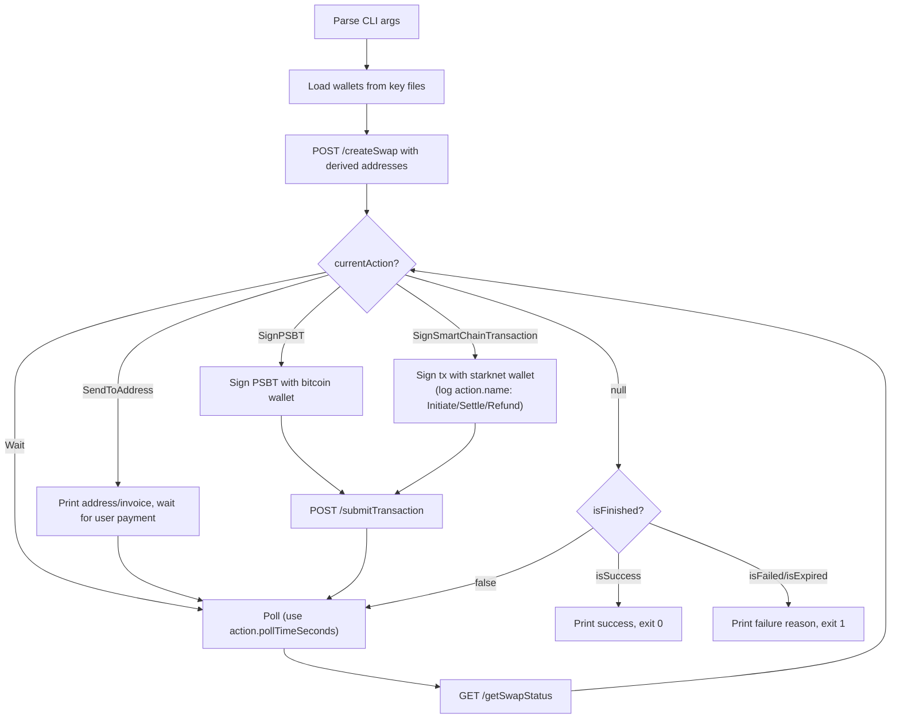

# Test Swap CLI — Design Spec

A single TypeScript script that exercises the atomiq REST API end-to-end by creating swaps, signing transactions locally, submitting them, and polling until settlement.

## Invocation

```bash
npx ts-node src/scripts/test-swap.ts <srcToken> <dstToken> <amount> <amountType>
```

Examples:
```bash
# BTC on-chain → STRK
npx ts-node src/scripts/test-swap.ts BTC STRK 3000 EXACT_IN

# STRK → BTC on-chain
npx ts-node src/scripts/test-swap.ts STRK BTC 50000000000000000000 EXACT_IN

# STRK → BTC Lightning
npx ts-node src/scripts/test-swap.ts STRK BTCLN 50000000000000000000 EXACT_IN

# Lightning → STRK
npx ts-node src/scripts/test-swap.ts BTCLN STRK 3000 EXACT_IN
```

## File

`src/scripts/test-swap.ts` — single file, no additional modules.

## Swap Lifecycle



## CLI Arguments

| Position | Name | Description | Example |
|----------|------|-------------|---------|
| 1 | srcToken | Source token ticker | `BTC`, `BTCLN`, `STRK` |
| 2 | dstToken | Destination token ticker | `STRK`, `BTC`, `BTCLN` |
| 3 | amount | Amount in base units (string) | `3000` (sats), `50000000000000000000` (STRK wei) |
| 4 | amountType | `EXACT_IN` or `EXACT_OUT` | `EXACT_IN` |

## Address Resolution

The script derives `srcAddress` and `dstAddress` from loaded wallets based on swap direction:

| Swap Direction | srcAddress | dstAddress |
|---------------|------------|------------|
| BTC → STRK | bitcoin wallet address | starknet wallet address |
| BTCLN → STRK | `""` (empty — no source address for LN receive) | starknet wallet address |
| STRK → BTC | starknet wallet address | bitcoin wallet address |
| STRK → BTCLN | starknet wallet address | `""` (empty — API will return a Lightning invoice to pay) |

For BTCLN→STRK: the `srcAddress` is empty because the SDK/LP generates the Lightning invoice. The script receives it via the `SendToAddress` action and prints it for the user to pay externally.

For STRK→BTCLN: the `dstAddress` is empty. In practice the user would provide a Lightning invoice or LNURL-pay, but for test purposes we leave it empty and let the SDK handle it (may need a pre-created invoice — if so, fail with a clear message).

## Wallet Loading

Keys are stored as files in the project root (gitignored):

| File | Format | Used when |
|------|--------|-----------|
| `bitcoin.key` | WIF string | src or dst is `BTC` or `BTCLN` |
| `starknet.key` | Hex private key string | src or dst is `STRK` |

The script derives addresses from the keys at startup and prints them.

For `getSwapStatus` calls involving Bitcoin, the script passes `bitcoinAddress` and `bitcoinPublicKey` query params so the API returns funded PSBTs (instead of raw PSBTs that require UTXO selection).

## Action Handling

### SignPSBT (BTC → Smart Chain swaps)
1. Read `psbtHex` from `currentAction.txs[0]`
2. Parse into a `Transaction` object via `@scure/btc-signer`
3. For `FUNDED_PSBT`: sign the specified `signInputs` indices with the bitcoin private key
4. For `RAW_PSBT`: log error and exit code 1 — should not occur when `bitcoinAddress`/`bitcoinPublicKey` are provided
5. Serialize the signed PSBT back to hex
6. Submit via `POST /submitTransaction` with `signedTxs: [signedPsbtHex]`

### SignSmartChainTransaction (Smart Chain → BTC swaps)
1. Receive serialized transaction string(s) from `currentAction.txs`
2. Log the action name (`"Initiate swap"`, `"Settle manually"`, or `"Refund"`) so the user knows what's being signed
3. Deserialize each transaction, sign with starknet wallet
4. Submit signed tx(s) via `POST /submitTransaction`

### SendToAddress (Lightning/Bitcoin deposits)
1. Print the address/invoice from `currentAction.txs[0].address`
2. Print the amount from `currentAction.txs[0].amount`
3. If Lightning (`chain === "LIGHTNING"`): print the BOLT11 invoice for the user to pay externally
4. If Bitcoin on-chain (`chain === "BITCOIN"`): print the Bitcoin address and amount
5. Continue polling — the API detects the payment

### Wait
1. Print what we're waiting for (`currentAction.name`, `expectedTimeSeconds`)
2. Continue polling using `currentAction.pollTimeSeconds` as the interval

## Secret Handling (Lightning swaps)

For BTCLN→STRK swaps, the `SwapStatusResponse` may include `requiresSecretReveal: true`. This indicates the swap needs the Lightning payment secret (pre-image) to progress settlement.

When `requiresSecretReveal` is `true`:
- The script should already have the secret from the Lightning payment (the pre-image is revealed when the invoice is paid)
- Pass it as the `secret` query param on subsequent `GET /getSwapStatus` calls
- For this test script, since Lightning payments happen externally, we cannot automatically obtain the secret. Print a message asking the user to provide it, or skip this flow with a note.

**Note:** In practice, an automated test for Lightning→Smart chain would need an LND node or similar to pay the invoice and capture the pre-image. This is out of scope for the initial script — the script will print the invoice and note that Lightning source swaps require manual payment.

## Polling

- Poll `GET /getSwapStatus` at the interval specified by `currentAction.pollTimeSeconds` (default 5s when no action or no poll time specified)
- Print state changes (when `state.name` changes from previous poll)
- On each poll, check `currentAction` — if a new action appears (e.g., manual settlement needed after timeout), handle it
- Timeout after 10 minutes — exit with error and last known state

## Terminal States

When `isFinished === true`, check the reason:
- `isSuccess`: print success summary (input, output, duration), exit 0
- `isFailed`: print failure reason from `state.description`, exit 1
- `isExpired`: print expiry message, exit 1

If `steps` contains a `Refund` step with `status: "awaiting"`, print a note that the swap can be refunded (but don't automatically refund — that's a separate user action).

## API Configuration

| Source | Variable | Default |
|--------|----------|---------|
| env / hardcoded | `API_URL` | `http://localhost:3000` |

## Dependencies

The script is a **pure REST API client** — it does NOT import the SDK. It uses:
- Built-in `fetch` (Node 18+) for HTTP calls
- `@scure/btc-signer` for PSBT signing (already a transitive dep)
- `starknet` for smart chain tx signing (needs to be added as a dep)

The `gasAmount` field on `createSwap` is not used by this script (test wallets already have gas).

## Output

The script prints a running log:
```
Loaded bitcoin wallet: tb1q03jwr3me0k9e9pfq9ukll7z6fsfgaj0qzmwqkk
Loaded starknet wallet: 0x34ed101119717656d5fc0fa69eb9688539d22c1049e42ed448b497b32d9dfa4

Creating swap: BTC → STRK, 3000 sats (EXACT_IN)...
  srcAddress: tb1q03jwr3me0k9e9pfq9ukll7z6fsfgaj0qzmwqkk
  dstAddress: 0x34ed101119717656d5fc0fa69eb9688539d22c1049e42ed448b497b32d9dfa4

Swap created: e39bce0b... (SPV_VAULT_FROM_BTC)
  Input: 0.00003000 BTC
  Output: 49.565 STRK
  Fees: swap=159 sats, network=238 sats
  Quote expires in 38s

Action: SignPSBT (Deposit on Bitcoin) — signing funded PSBT...
  Submitting signed transaction...
  TX submitted: abcd1234...

[CREATED → BTC_TX_CONFIRMED] Bitcoin confirmations: 1/1

[CLAIM_COMMITED] Waiting for automatic settlement...

Swap completed successfully!
  Input: 0.00003000 BTC → Output: 49.565 STRK
  Duration: 2m 34s
```

Failure example:
```
Swap failed!
  State: EXPIRED — Quote expired before bitcoin transaction was confirmed
  Exit code: 1
```

## Error Handling

- API errors: print error message from response, exit code 1
- Timeout (10 min): print timeout message with last known state, exit code 1
- Signing errors: print error, exit code 1
- Missing key files: print which file is missing and what it's needed for, exit code 1
- RAW_PSBT received unexpectedly: log error explaining bitcoin wallet params should have been passed, exit code 1
