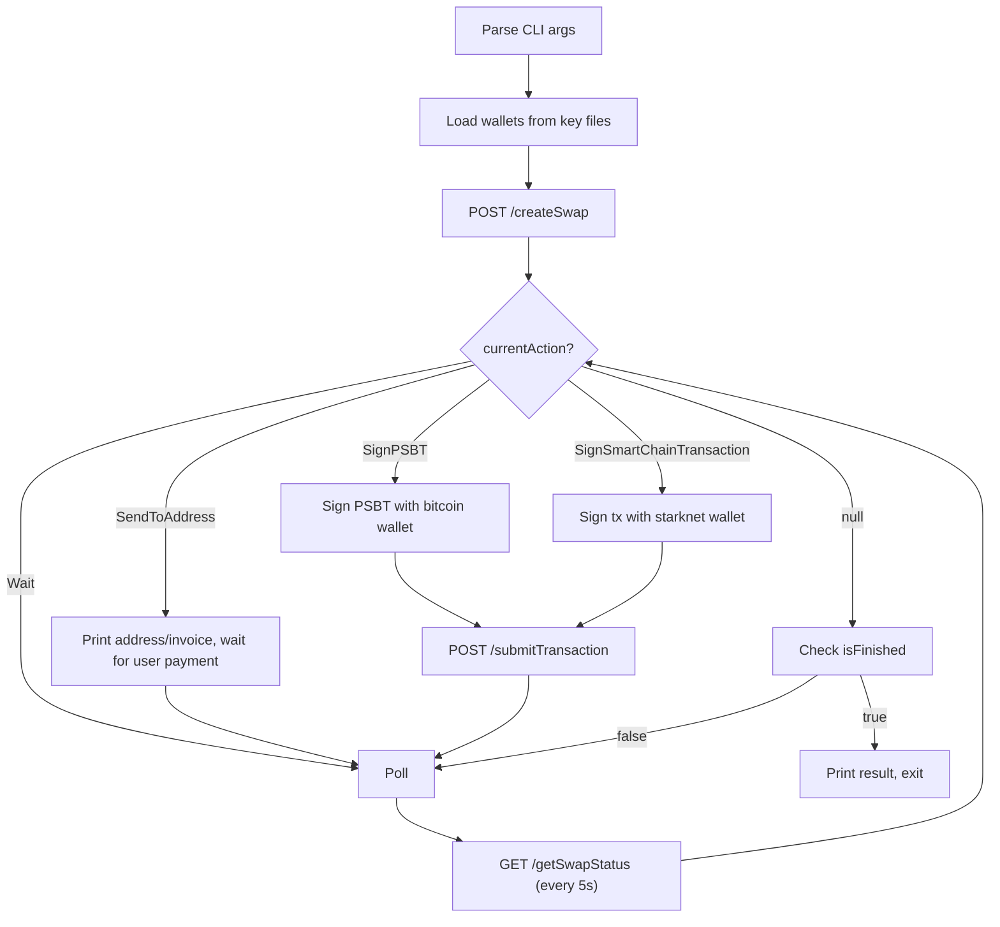

# Test Swap CLI — Design Spec

A single TypeScript script that exercises the atomiq REST API end-to-end by creating swaps, signing transactions locally, submitting them, and polling until settlement.

## Invocation

```bash
npx ts-node src/scripts/test-swap.ts <srcToken> <dstToken> <amount> <amountType>
```

Examples:
```bash
# BTC on-chain → STRK
npx ts-node src/scripts/test-swap.ts BTC STRK 3000 EXACT_IN

# STRK → BTC Lightning
npx ts-node src/scripts/test-swap.ts STRK BTCLN 50000000000000000000 EXACT_IN

# Lightning → STRK
npx ts-node src/scripts/test-swap.ts BTCLN STRK 3000 EXACT_IN
```

## File

`src/scripts/test-swap.ts` — single file, no additional modules.

## Swap Lifecycle



## CLI Arguments

| Position | Name | Description | Example |
|----------|------|-------------|---------|
| 1 | srcToken | Source token ticker | `BTC`, `BTCLN`, `STRK` |
| 2 | dstToken | Destination token ticker | `STRK`, `BTC`, `BTCLN` |
| 3 | amount | Amount in base units (string) | `3000` (sats), `50000000000000000000` (STRK wei) |
| 4 | amountType | `EXACT_IN` or `EXACT_OUT` | `EXACT_IN` |

## Wallet Loading

Keys are stored as files in the project root (gitignored):

| File | Format | Used when |
|------|--------|-----------|
| `bitcoin.key` | WIF string | src or dst is `BTC` or `BTCLN` |
| `starknet.key` | Hex private key string | src or dst is `STRK` |

The script derives addresses from the keys at startup and prints them.

For `getSwapStatus` calls, the script passes `bitcoinAddress` and `bitcoinPublicKey` query params so the API returns funded PSBTs (instead of raw PSBTs that require UTXO selection).

## Action Handling

### SignPSBT (BTC → Smart Chain swaps)
1. Receive PSBT hex/base64 from `currentAction.txs`
2. For `FUNDED_PSBT`: sign the specified `signInputs` indices
3. For `RAW_PSBT`: this shouldn't happen when `bitcoinAddress`/`bitcoinPublicKey` are provided — the API returns funded PSBTs. If it does occur, log an error.
4. Submit signed PSBT via `POST /submitTransaction`

### SignSmartChainTransaction (Smart Chain → BTC swaps)
1. Receive serialized transaction(s) from `currentAction.txs`
2. Deserialize and sign with starknet wallet
3. Submit signed tx(s) via `POST /submitTransaction`

### SendToAddress (Lightning deposits)
1. Print the Lightning invoice or Bitcoin address
2. The user pays externally (e.g., from a Lightning wallet)
3. Continue polling — the API detects the payment

### Wait
1. Print what we're waiting for (`currentAction.name`, `expectedTimeSeconds`)
2. Continue polling

## Polling

- Poll `GET /getSwapStatus` every 5 seconds
- Print state changes (when `state.name` changes from previous poll)
- On each poll, check `currentAction` — if a new action appears (e.g., manual settlement needed), handle it
- Timeout after 10 minutes — exit with error

## API Configuration

| Source | Variable | Default |
|--------|----------|---------|
| env / hardcoded | `API_URL` | `http://localhost:3000` |

## Dependencies

The script is a **pure REST API client** — it does NOT import the SDK. It uses:
- Built-in `fetch` (Node 18+) for HTTP calls
- `@scure/btc-signer` for PSBT signing (already a transitive dep)
- `starknet` for smart chain tx signing (needs to be added as a dep)

## Output

The script prints a running log:
```
Loaded bitcoin wallet: tb1q03jwr3me0k9e9pfq9ukll7z6fsfgaj0qzmwqkk
Loaded starknet wallet: 0x34ed101119717656d5fc0fa69eb9688539d22c1049e42ed448b497b32d9dfa4

Creating swap: BTC → STRK, 3000 sats (EXACT_IN)...
Swap created: e39bce0b... (SPV_VAULT_FROM_BTC)
  Input: 0.00003000 BTC
  Output: 49.565 STRK
  Fees: swap=159 sats, network=238 sats
  Quote expires in 38s

Action: SignPSBT — Sign and submit Bitcoin PSBT
  Signing PSBT...
  Submitting signed transaction...
  TX submitted: abcd1234...

Waiting for confirmation... [state: PR_CREATED → BTC_TX_CONFIRMED]
  Bitcoin confirmations: 1/1

Waiting for settlement... [state: CLAIM_COMMITED]
  Settled! TX: 0xdef456...

Swap completed successfully!
  Input: 0.00003000 BTC
  Output: 49.565 STRK
  Duration: 2m 34s
```

## Error Handling

- API errors: print error message, exit code 1
- Timeout: print timeout message with last known state, exit code 1
- Signing errors: print error, exit code 1
- Missing key files: print which file is missing, exit code 1
